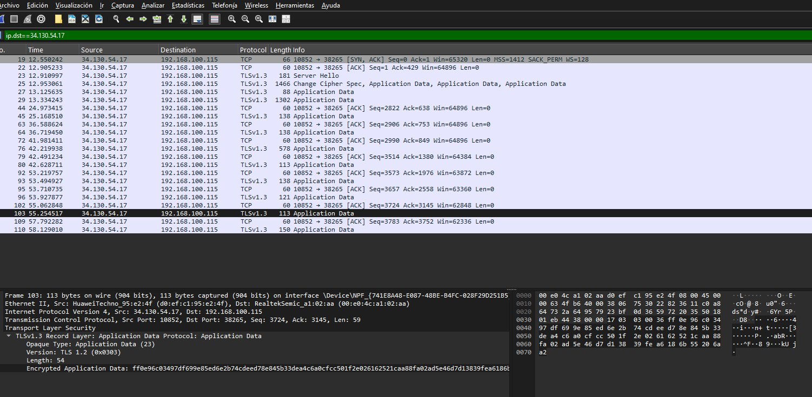
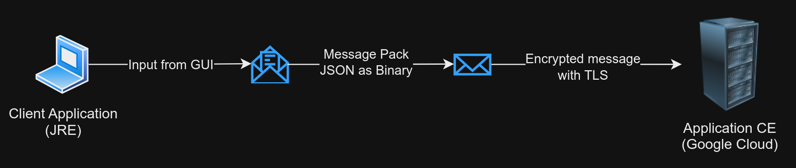
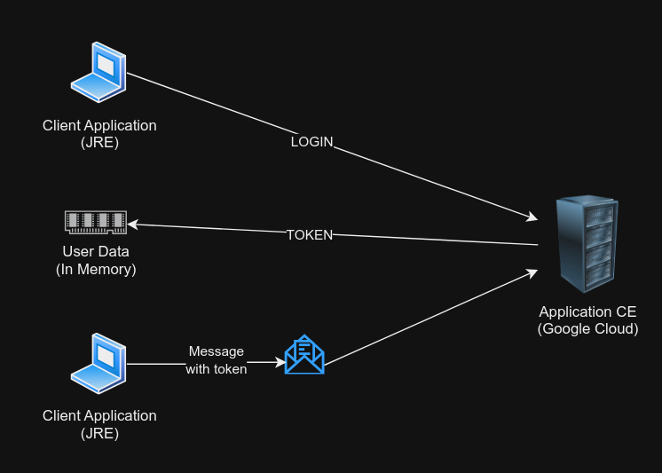
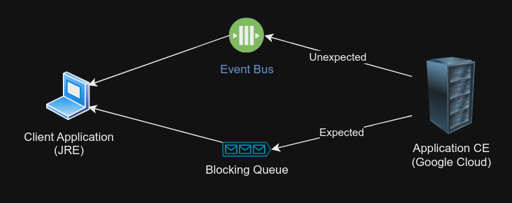
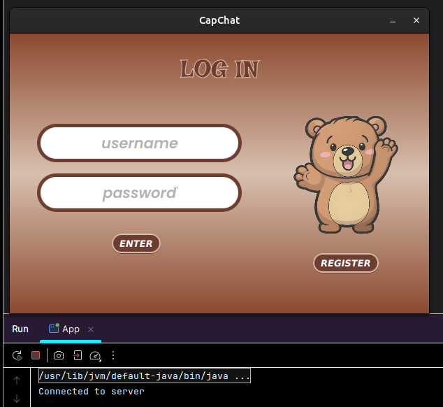
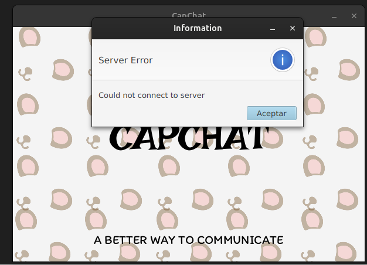

# Client Application

# 1. Architecture
> This structure reflects a combination of two common software design patterns:

## 1.1. Layered Architecture:

> * Responsibilities are divided into config, service, controller, and domain layers.
> * Each layer has clearly defined roles:
> * * Controller: Manages interaction between views and services.
> * * Service: Handles business logic and communication with remote systems.
> * * Domain: Defines core data models and operations.

## 1.2. MVC (Model-View-Controller):

> * Views represent the UI elements.
> * Controllers act as intermediaries between the UI and logic.
> * Models in the domain layer represent the state and behavior of the application.

# 2. Before running
## 2.1. TLS security
> Ensure to get the certificate file generated by the server and store it into the root of the project.
> The certificate needs to be registered into the keystore file.
> ```shell
> keytool -import -alias [CERTIFICATE_ALIAS] -file [PATH_TO_CERTIFICATE.CER] -keystore [PATH_TO_KEYSTORE]
> ```
> The keystore must be moved to the resources' folder.

## 2.2. Properties
> There must be a .properties file in resources were are stored the following content:
```shell
SOCKET_PORT=
SERVER_HOST=
KEYSTORE_PATH=
KEYSTORE_PASS=
```

# 3. How it works?
## 3.1. Databases
> * There are currently two databases running for the server.
> * There's a MySQL server dedicated to store the data related to users, messages and chats.
> * The other database is an in-memory one, this stores the data about users that are currently online and their `path` to their sockets. This helps to keep a reference to the connection bridges for logged users.
> * The clients can only interact with the Application Server.


## 3.2. Security
> * The security layer managed with TLS works by creating the public/private key, then it generated a certificate which is shared with the client and saved on its `truststore`.
> * Once the certificate is compared to the sent by the server, the connection can be established.
> * This is not a common practice, but it works for an own-signed certificate.


> * If you intercept the packages by using `Wireshark`, the result is the following:



## 3.3. Messages Body
> * The way that messages are sent is by using binary mapping with `Message Pack`.
> * The system is protected against SQL injections by transferring an ASCII array instead of plain text. That means that the messages are transformed rapidly to an array before being sent to the server and before being shown to the client.



## 3.4. Session management
> * The session starts in the server immediately a connection is received. But, for the client the `User` is defined after the login process gets terminated.
> * Once the login process finishes, the user get its token, and it must be used for each request to the server.



## 3.5. Client message receptor system
> * The client application has 2 ways to react to server responses: By using and EventBus and a BlockingQueue.
> * The event bus manages the unexpected server responses (new message notification, added to chat notification). Messages from the server that are received without sending a request.
> * The blocking queue manages the expected server responses (create chat, send message, create account). Messages from the server that are received after sending a request.
> * It is important to clarify that both kind of messages are received through the socket created when connecting to the server.



## 4. Running Proof

> * Once the client app connects to the server the login page must appear instantly:



> * Otherwise, the result is the following:


